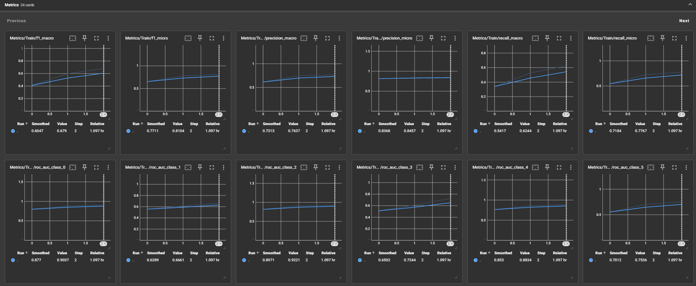

# multilabel-text-classification

<a target="_blank" href="https://cookiecutter-data-science.drivendata.org/">
    
</a>

Аллаяров Тимур Рустамович. БИВТ-21-17.

Проект по Advanced NLP 2024–2025.

## Project Organization

```
├── LICENSE            <- Open-source license if one is chosen
├── Makefile           <- Makefile with convenience commands like `make data` or `make train`
├── README.md          <- The top-level README for developers using this project.
├── data
│   ├── external       <- Data from third party sources.
│   ├── interim        <- Intermediate data that has been transformed.
│   ├── processed      <- The final, canonical data sets for modeling.
│   └── raw            <- The original, immutable data dump.
│
├── docs               <- A default mkdocs project; see www.mkdocs.org for details
│
├── models             <- Trained and serialized models, model predictions, or model summaries
│
├── notebooks          <- Jupyter notebooks. Naming convention is a number (for ordering),
│                         the creator's initials, and a short `-` delimited description, e.g.
│                         `1.0-jqp-initial-data-exploration`.
│
├── pyproject.toml     <- Project configuration file with package metadata for 
│                         multilabel_text_classification and configuration for tools like black
│
├── references         <- Data dictionaries, manuals, and all other explanatory materials.
│
├── reports            <- Generated analysis as HTML, PDF, LaTeX, etc.
│   └── figures        <- Generated graphics and figures to be used in reporting
│
├── requirements.txt   <- The requirements file for reproducing the analysis environment, e.g.
│                         generated with `pip freeze > requirements.txt`
│
├── setup.cfg          <- Configuration file for flake8
│
└── multilabel_text_classification   <- Source code for use in this project.
    │
    ├── __init__.py             <- Makes multilabel_text_classification a Python module
    │
    ├── config.py               <- Store useful variables and configuration
    │
    ├── dataset.py              <- Scripts to download or generate data
    │   
    ├── preprocessing.py        <- Scripts to preprocess data
    │
    ├── features.py             <- Code to create features for modeling
    │
    ├── entities                
    │   │
    │   ├── __init__.py 
    │   │
    │   └── params.py            <- Сode to process parameters
    ├── modeling                
    │   │
    │   ├── __init__.py 
    │   │
    │   ├── train_multi_cls.py  <- Code to train a multi-label classifier using multiple [CLS] tokens
    │   │
    │   ├── train_single_cls.py <- Code to train a multi-label classifier using a single [CLS] token
    │   │
    │   └── train.py            <- Scripts to help train models
    │
    └── plots.py                <- Code to create visualizations
```

--------

# Отчет

## Решаемая задача

Попробовать разные подходы к архитектуре трансформер-энкодера для задачи многоклассовой классификации, взяв за основу предобученную модель [XLM-RoBERTa](https://huggingface.co/FacebookAI/xlm-roberta-base).

Реализованы и сравнены два варианта классификатора:

1. Классический подход – использует стандартный [CLS]-токен, который проходит через несколько полносвязных слоев для предсказания меток.
2. Подход с несколькими [CLS]-токенами – добавляет отдельные [CLS]-токены для каждого класса, обрабатывает их энкодером и применяет к ним общий классификатор.

Обе архитектуры обучены на размеченном датасете, рассчитаны метрики качества, проведено сравнение их эффективности.

Данные, используемые для обучения: [Toxic Comment Classification Challenge](https://www.kaggle.com/competitions/jigsaw-toxic-comment-classification-challenge)

## Результаты

### Один \[CLS\]-токен


### Несколько \[CLS\]-токенов





## Выводы

Вторая модель показала немного лучшие результаты на обучающей выборке, но уступила на валидационной, что указывает на переобучение. Значение f1-micro у второй модели выше, но разница незначительная и может находиться в пределах погрешности.

Первая модель, хотя и показывает в среднем чуть худшие результаты, выглядит более устойчивой, так как не склонна к переобучению, в отличие от второй. Поэтому при выборе модели для решения текущей задачи я бы предпочел первую. Однако возможен и другой путь — дальнейший подбор параметров для второй модели с целью улучшения ее устойчивости.
